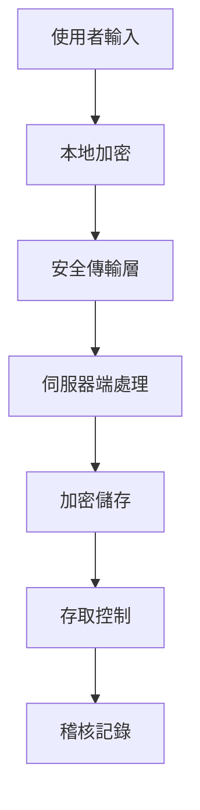

# Poignée 伴阮 - 數位陪伴助手

## 專案簡介

Poignée (伴阮) 是一款專為早期至中期失智症患者設計的溫暖、人性化數位陪伴助手。透過 AI 語音互動、記憶日記功能及家庭連結平台，維護患者尊嚴，促進情感交流，同時減輕家庭照護者的負擔。

## 核心價值

- **陪伴而非糾正**：AI 對話溫和、支持，不糾正患者錯誤，維護其尊嚴
- **文化敏感性**：深度融合台灣和加拿大等地的文化、節慶、語言習慣
- **跨世代連結**：透過翻譯和分享功能，幫助分散各地的家庭成員保持緊密聯繫
- **記憶保存與喚醒**：提供便捷的日記功能，記錄生活點滴，並透過 AI 喚醒美好回憶
- **隱私與安全**：在設計上充分考慮用戶隱私和數據安全

## 主要功能

### 1. AI 陪伴 (AI Companion)
- 語音互動對話
- 情緒分析與支持
- 文化適應回應
- 對話歷史記錄

### 2. 記憶日記 (Memory Journal)
- 記錄生活回憶
- 分類管理（日常生活、家庭時光、旅行、美食、節慶、童年）
- 情緒標記
- 家人分享功能

### 3. 家人連結 (Family Connection)
- 每日摘要分享
- 家庭成員管理
- 跨時區支援
- 多語言溝通

### 4. 文化寶庫 (Cultural Content)
- 節慶文化內容
- 懷舊音樂
- 傳統故事
- 互動話題引導

### 5. 情緒追蹤 (Emotion Tracking)
- 心情趨勢圖表
- 情緒分析統計
- 洞察與建議

## 技術架構

### 前端技術
- **React 18** with TypeScript
- **Vite** - 建構工具
- **Tailwind CSS** - 樣式框架
- **Framer Motion** - 動畫效果
- **Zustand** - 狀態管理
- **React Router** - 路由管理
- **Recharts** - 數據視覺化
- **Lucide React** - 圖標庫

### UI/UX 設計
- **Glassmorphism** 視覺風格
- **Mobile-first** 響應式設計
- 流暢的動畫與過渡效果
- 無障礙設計考量

## 安裝與執行

### 環境需求
- Node.js 16+
- npm 或 yarn

### 安裝步驟

1. 安裝依賴套件
```bash
npm install
```

2. 啟動開發伺服器
```bash
npm run dev
```

3. 建構生產版本
```bash
npm run build
```

4. 預覽生產版本
```bash
npm run preview
```

## 專案結構

```
src/
├── components/       # 可重用組件
│   ├── Layout.tsx   # 主要佈局組件
│   └── GlassCard.tsx # 毛玻璃卡片組件
├── pages/           # 頁面組件
│   ├── Dashboard.tsx
│   ├── AICompanion.tsx
│   ├── MemoryJournal.tsx
│   ├── FamilyConnection.tsx
│   ├── CulturalContent.tsx
│   └── EmotionTracking.tsx
├── stores/          # Zustand 狀態管理
│   └── useAppStore.ts
├── services/        # API 服務與模擬數據
│   └── mockData.ts
├── types/           # TypeScript 類型定義
│   └── index.ts
├── utils/           # 工具函數
│   └── helpers.ts
├── App.tsx          # 主應用組件
├── main.tsx         # 應用入口
└── index.css        # 全域樣式
```

## 開發指南

### 添加新功能
1. 在 `types/` 中定義數據類型
2. 在 `stores/` 中添加狀態管理
3. 在 `pages/` 中創建頁面組件
4. 在 `App.tsx` 中配置路由

### 樣式開發
- 使用 Tailwind CSS 進行樣式開發
- 自定義玻璃效果類別在 `index.css` 中定義
- 遵循 Mobile-first 設計原則

### 狀態管理
- 使用 Zustand 進行全域狀態管理
- 保持狀態結構扁平化
- 避免深層嵌套的狀態更新

## AIPET 應對策略

針對台灣即將實施的《AI基本法》(AIPET - AI Personal Data Protection and Ethics Technology)，Poignée 制定了完整的合規應對方案：

### 🛡️ 個人資料保護 (Personal Data Protection)

#### 資料分類與處理
- **敏感醫療資料**：失智症相關健康資訊、用藥記錄、行為模式
  - 採用端對端加密 (E2E Encryption)
  - 本地化儲存優先，最小化雲端傳輸
  - 符合《個人資料保護法》特種個人資料處理規範

- **一般個人資料**：姓名、聯絡方式、家庭成員資訊
  - 實施資料最小化原則 (Data Minimization)
  - 明確告知資料蒐集目的與使用範圍
  - 提供資料修正、刪除權限

#### 同意機制設計
```typescript
interface ConsentManager {
  medicalData: boolean;      // 醫療資料處理同意
  familySharing: boolean;    // 家庭分享功能同意
  aiAnalysis: boolean;       // AI分析處理同意
  dataRetention: string;     // 資料保存期限選擇
  thirdPartySharing: boolean; // 第三方分享同意
}
```

### 🤖 AI 演算法透明度 (Algorithm Transparency)

#### 演算法說明機制
- **情緒分析模型**：
  - 提供演算法決策邏輯說明
  - 定期發布模型效能報告
  - 開放演算法偏見檢測結果

- **記憶喚醒推薦**：
  - 解釋推薦內容選擇原因
  - 允許使用者調整推薦參數
  - 提供演算法影響評估報告

#### 可解釋AI實作
```javascript
// AI決策解釋功能
function explainRecommendation(memoryId, factors) {
  return {
    decision: "推薦此記憶內容",
    reasoning: [
      "基於您最近的情緒狀態分析",
      "與家庭成員互動頻率考量",
      "相似回憶的正面回饋記錄"
    ],
    confidence: 0.85,
    alternativeOptions: [...],
    userControl: "可在設定中調整推薦偏好"
  };
}
```

### ⚖️ 演算法倫理 (Algorithmic Ethics)

#### 偏見消除措施
- **文化多樣性**：
  - 訓練資料涵蓋多元文化背景
  - 定期檢測文化偏見指標
  - 建立文化適應性評估機制

- **年齡公平性**：
  - 避免年齡歧視的語言模式
  - 確保不同年齡層使用者體驗公平
  - 建立跨世代溝通橋樑

#### 倫理審查機制
```yaml
# 倫理審查檢查清單
ethics_checklist:
  dignity_preservation: true    # 尊嚴維護
  non_discrimination: true      # 無歧視原則
  beneficence: true            # 有益性原則
  autonomy_respect: true       # 自主性尊重
  justice: true               # 公正性原則
  transparency: true          # 透明度原則
```

### 🔐 技術實作規範 (Technical Implementation)

#### 資料安全架構


#### 隱私保護技術
- **聯邦學習** (Federated Learning)：AI模型訓練不離開本地設備
- **差分隱私** (Differential Privacy)：統計分析時保護個人隱私
- **同態加密** (Homomorphic Encryption)：加密狀態下進行計算
- **零知識證明** (Zero-Knowledge Proof)：驗證身份而不洩露資訊

### 📋 合規監控機制 (Compliance Monitoring)

#### 自動化合規檢測
```python
class ComplianceMonitor:
    def __init__(self):
        self.checks = [
            self.check_data_minimization,
            self.check_consent_validity,
            self.check_algorithm_fairness,
            self.check_security_measures
        ]
    
    def daily_compliance_audit(self):
        results = []
        for check in self.checks:
            result = check()
            results.append(result)
            if not result.passed:
                self.trigger_alert(result)
        return results
```

#### 定期合規報告
- **月度隱私影響評估**：評估新功能對隱私的影響
- **季度演算法公平性稽核**：檢視AI決策的公平性
- **年度倫理審查**：全面檢視產品倫理合規狀況

### 📖 使用者權利保障 (User Rights Protection)

#### 資料主體權利實現
- **資料攜帶權**：提供標準格式的資料匯出功能
- **被遺忘權**：完整刪除使用者資料的能力
- **資料修正權**：允許使用者修正錯誤資料
- **處理限制權**：暫停特定資料處理活動

#### 申訴處理機制
```typescript
interface GrievanceSystem {
  submitComplaint: (issue: ComplianceIssue) => Promise<CaseId>;
  trackStatus: (caseId: CaseId) => Promise<CaseStatus>;
  escalateToRegulator: (caseId: CaseId) => Promise<void>;
  provideFeedback: (caseId: CaseId, feedback: string) => Promise<void>;
}
```

### 🎯 實施時程規劃 (Implementation Timeline)

#### 第一階段 (2025 Q1-Q2)：基礎合規
- [ ] 完成隱私政策更新
- [ ] 實作基本同意管理機制
- [ ] 建立資料分類與標記系統
- [ ] 部署基礎加密措施

#### 第二階段 (2025 Q3-Q4)：進階功能
- [ ] 實作聯邦學習架構
- [ ] 部署差分隱私技術
- [ ] 建立演算法解釋系統
- [ ] 完成倫理審查機制

#### 第三階段 (2026 Q1)：持續優化
- [ ] 自動化合規監控上線
- [ ] 使用者權利自助服務平台
- [ ] 第三方合規認證取得
- [ ] 國際標準對接完成

### 📞 AIPET 聯絡窗口

**合規事務聯絡人**：gainshin@outlook.com
**技術實作負責人**：Poignée Technical Team
**法務諮詢窗口**：Legal Affairs Department

---

Poignée 承諾在AI創新的同時，嚴格遵守AIPET規範，確保使用者權益與社會責任的平衡發展。

## 未來擴展

### 計劃功能
- 真實語音識別與合成 (Speech-to-Text / Text-to-Speech)
- 後端 API 整合
- 多語言自動翻譯
- 照片上傳與管理
- 視訊通話功能
- AI 個性化學習

### 技術優化
- Progressive Web App (PWA) 支援
- 離線功能
- 效能優化
- 無障礙功能增強

## 貢獻指南

歡迎貢獻代碼、回報問題或提供建議。請遵循以下步驟：

1. Fork 專案
2. 創建功能分支 (`git checkout -b feature/AmazingFeature`)
3. 提交更改 (`git commit -m 'Add some AmazingFeature'`)
4. 推送到分支 (`git push origin feature/AmazingFeature`)
5. 開啟 Pull Request

## 授權

本專案採用雙重授權模式：
- **Poignée 社群授權條款**：個人和有限組織使用
- **商業授權條款**：內部團隊部署和程式碼修改

詳見 LICENSE 文件或聯絡 gainshin@outlook.com 洽談商業授權。

## 聯絡資訊

**專案維護者**：gainshin  
**Email**：gainshin@outlook.com  
**商業合作**：gainshin@outlook.com  
**技術支援**：GitHub Issues

---

**Poignée 伴阮** - 讓科技帶來溫暖的陪伴 ❤️